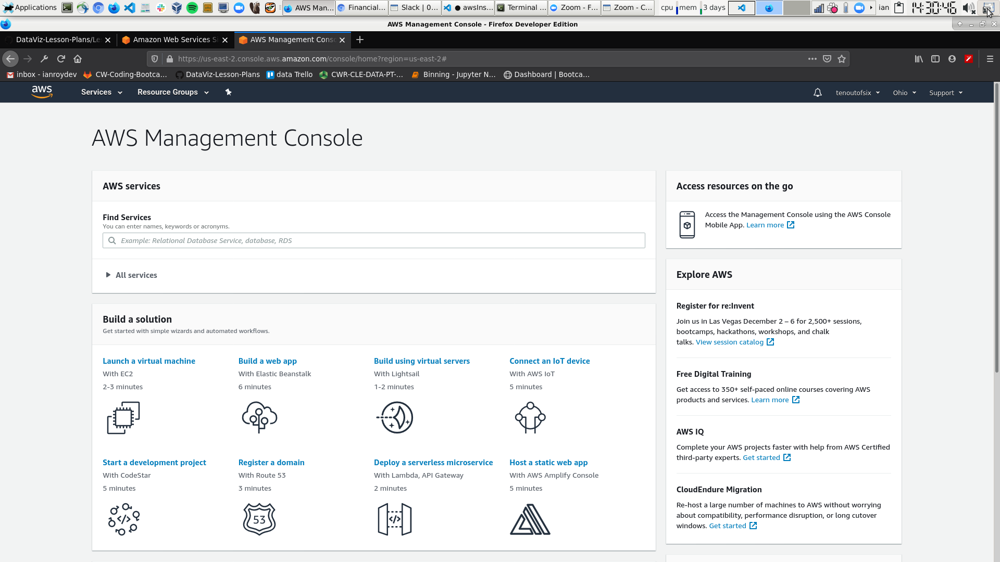

set up ec2 linux instance 

set up git repo for project

make a requirments.txt file 

set up ssh keys on ec2 so we can pull from repo. (skip if using public repo)

do git pull on ec2 

do pip install requiremnets.txt

start flask and gunicorn app 

maybe use tmux to keep it running 

open up port 80 on aws 

